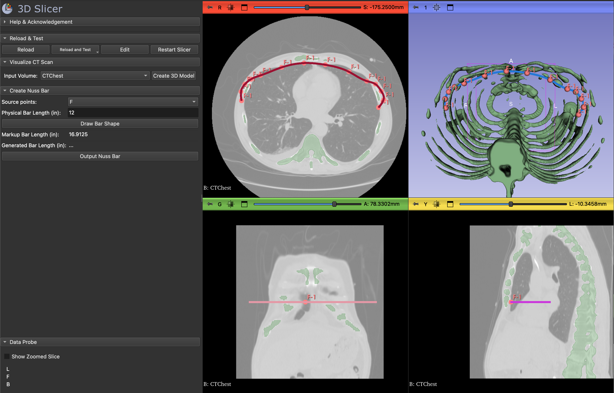

# ShapeNuss

This module is a planning and visualization tool for the Nuss Procedure. It can calculate and outputs a 3D model of the ideal Nuss Bar given the patient's CT scan, markups indicating the location of the bar, and the desired bar length.



## Motivation

The Nuss procedure is a minimally invasive procedure to repair Pectus Excavatum. Pectus excavatum is a condition in which a person’s breastbone is sunken into their chest, occurring in approximately 1 in 300-400 births. The Nuss procedure involves shaping a steel bar and placing it in the patient’s chest to push the breast bone forward, flattening the chest. 

Clinicians have told me that the standard protocol of this procedure is to shape the steel bar during surgery. Not only does this lengthen the duration of the surgery, but if the shape of the bar doesn’t match the patient’s chest, doctors have to take the bar out of the patient’s chest, reshape it, and try again until it properly fits. As a result, the pectoral muscles have to undergo more trauma, meaning that the patient must suffer more pain. This also prolongs the surgical procedure.

This work aims to help clinicians by providing a tool that can calculate the ideal shape of the bar before surgery. This way, the bar can be shaped before the surgery, reducing the duration of the surgery and the pain that the patient has to endure.

## Installation

Step 1: Install [3D Slicer](https://download.slicer.org/) to be able to run this extension

Step 2: Clone this repository. 

```bash
git clone https://github.com/AkhilDeo/ShapeNuss.git
```

Step 3: Open 3D Slicer and go to the Extension Manager (View / Extensions manager). Click on the "Install from file" button and select the NussBar folder in the repository you just cloned.
